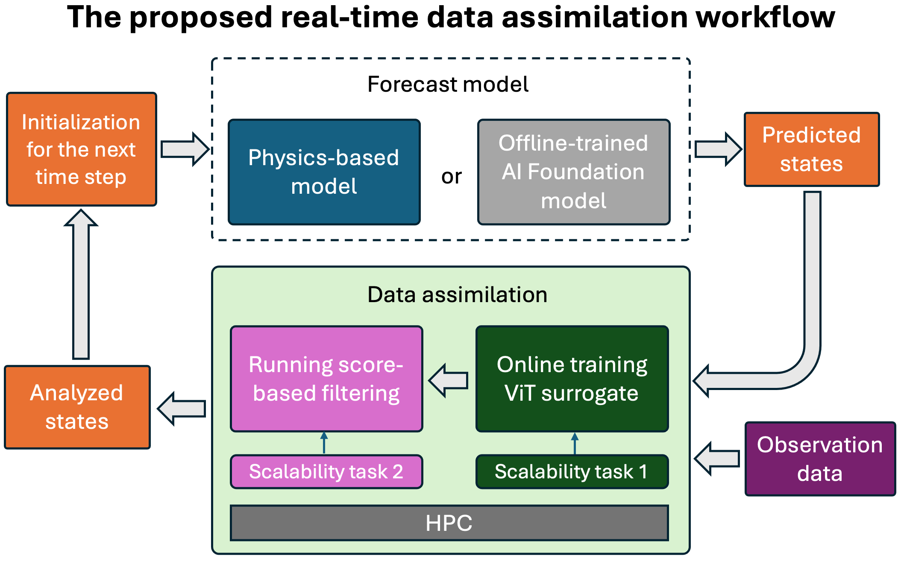

# A Scalable Real-Time Data Assimilation Framework for Predicting Turbulent Atmosphere Dynamics
This repository contains the scalable implementation of our generic real-time data assimilation (DA) framwork for estimating turbulent dynamics, consisting of ensemble score filter (EnSF), vision Transformer (ViT) surrogate, and coupled experiments.    


## Contributions
- A generic real-time data assimilation (DA) framework for estimating turbulent dynamics, providing significantly more accurate predictions than the state-of-the-art LETKF method.
- Strong and weak scaling capabilities of our proposed DA framework on the Frontier supercomputer.
- Large-scale ViT training up to 2.5B parameters on Frontier.

## EnSF scaling 
We show the scaling of EnSF with a high-dimensional Lorenz-96 system with up to 100M variables. The data is generated by 
```bash
python ensf/problem_gen.py
```
and the EnSF calculation follows 
```bash
python ensf/run_ensf.py 
```
A [job script](./ensf/job.sb) is provided for the scaling study on Frontier. 

## ViT scaling 
We show the scaling of ViT surrogate for [surface quasi-geostrophic (SQG)](https://github.com/jswhit/sqgturb) in following steps. 

### Data generation
We generate the SQG data using this [repo](https://github.com/jswhit/sqgturb).

### Data preprocesssing
We pre-process the SQG data as follows,
```bash
CMD="python ./src/data_preprocessing/sqg_256_split_mpi.py"
srun --nodes=${SLURM_NNODES} \
               --ntasks=$((SLURM_NNODES*8)) \
               --ntasks-per-node=8 \
               --gpu-bind=closest \
               -c7 \
               $CMD
CMD="python ./src/data_preprocessing/nc2np_equally_sqg_256_mpi.py \
--root_dir /mnt/bb/junqi/splited_2hr_per_file \
--save_dir /mnt/bb/junqi/sqg_256_npy_2hr_per_file \
--start_train_day 100 \
--start_val_day 2299 \
--start_test_day 2574  \
--end_day 2843 \
--num_shards 1
"
srun --nodes=${SLURM_NNODES} \
               --ntasks=$((SLURM_NNODES*8)) \
               --ntasks-per-node=8 \
               --gpu-bind=closest \
               -c7 \
               $CMD
```
### Distributed training 


## Coupled experiments

## Results
The plots of the results are generated using this [script](./plot.ipynb), and the corresponding raw job logs can be [downloaded](https://www.dropbox.com/scl/fo/yq9q60k8sjb2pknwij46t/AAXIzGohoFnCQ419YyXD6zI?rlkey=c2544bxgblrcezmycp8qtsfco&dl=0).  
